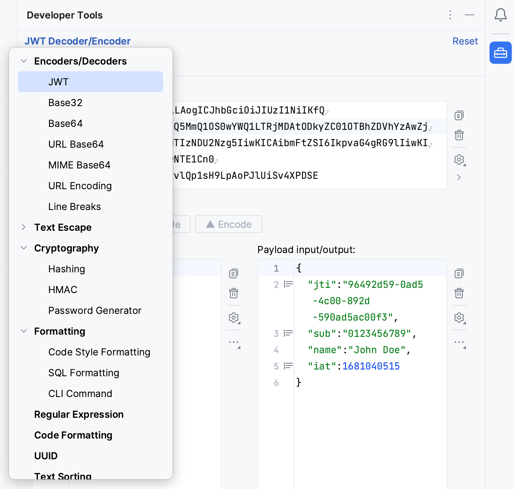
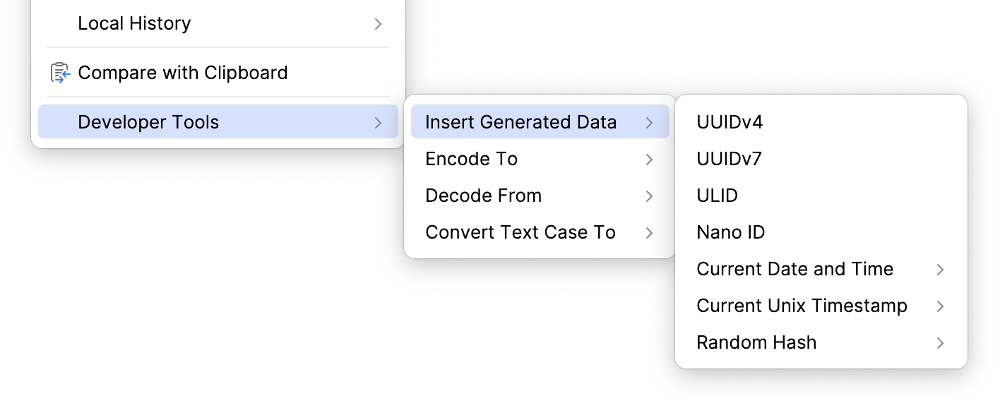

# IntelliJ Developer Tools Plugin

This plugin is a powerful and versatile set of tools designed to enhance the development experience for software engineers. With its extensive collection of features, developers can increase their productivity and simplify complex operations without leaving their coding environment.

Main toolbar window:

Editor menu:

Plugin icon by [Gabriele Malaspina](https://www.svgrepo.com/svg/489187/toolbox).

## Key Features

- Encoding and Decoding: JWT (JSON Web Tokens), Base32, Base64, URL Base64, MIME Base64, URL encoding and line breaks
- Regular Expression Matcher
- UUID, ULID, Nano ID and Password Generator
- Text Sorting
- Text Case Transformation
- Text Diff Viewer
- Text Format Conversion
- Text Escaping: HTML entities, Java Strings, JSON, CSV, and XML
- JSON Path Parser
- JSON Schema Validator
- Hashing
- Archive (ZIP, TAR, JAR, 7z, ...) viewer and extractor
- Date Time Converter
- Time Conversion
- Code Style Formatting
- SQL Formatting
- Color Picker
- QR Code/Barcode Generator
- Lorem Ipsum Generator

## Integration

The main tools are currently available as a standalone dialog or tool window. Additionally, some tools are also available via the editor menu or code intentions. Some of these tools are only available if a text is selected, or the current caret position is on a Java/Kotlin string or identifier.

The plugin settings can be found in IntelliJ's settings/preferences under **Tools | Developer Tools**.

### Tool Window

The tool window is available through **View | Tool Windows | Tools**. All inputs and configurations of a tool window will be stored on the project level.

### Dialog

The action to access the dialog is available through IntelliJ's main menu under **Tools | Developer Tools**.

To add the "Open Dialog" action to the main toolbar, we can either enable it in IntelliJ's settings/preferences under **Tools | Developer Tools**, or manually add the action via **Customize Toolbar... | Add Actions... | Developer Tools**.

All inputs and configurations of the dialog will be stored on the application level.

## Development

This plugin is not seen as a library. Therefore, code changes do not necessarily adhere to the semantics version rules.

If you want to contribute something, please follow the code style in the `.editorconfig` and sign your commits.

## License

Copyright (c) 2024 Marcel Kliemannel

Licensed under the **Apache License, Version 2.0** (the "License"); you may not use this file except in compliance with the License.

You may obtain a copy of the License at <https://www.apache.org/licenses/LICENSE-2.0>.

Unless required by applicable law or agreed to in writing, software distributed under the License is distributed on an "AS IS" BASIS, WITHOUT WARRANTIES OR CONDITIONS OF ANY KIND, either express or implied. See the [LICENSE](./LICENSE) for the specific language governing permissions and limitations under the License.
