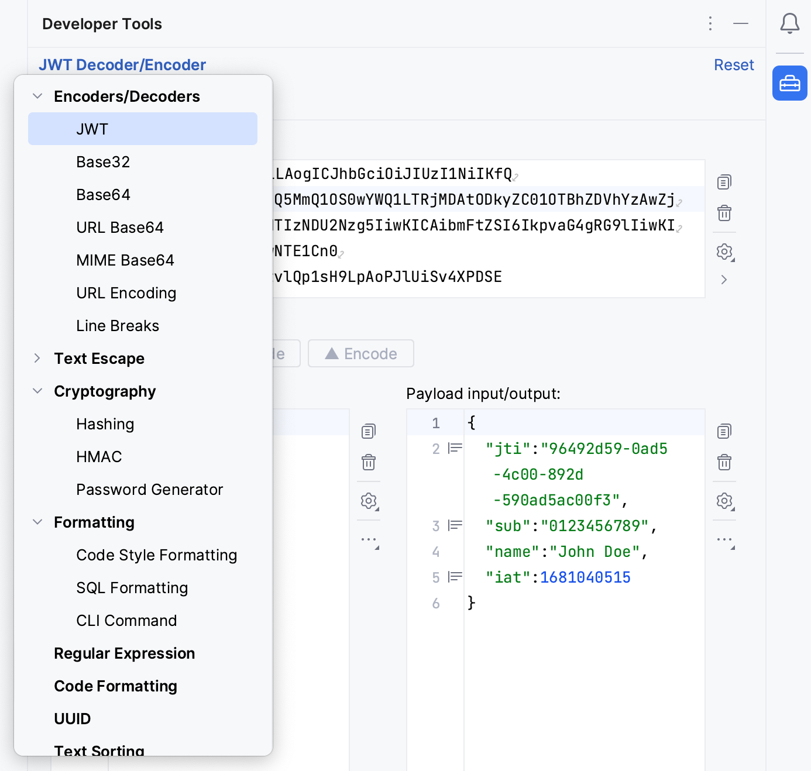
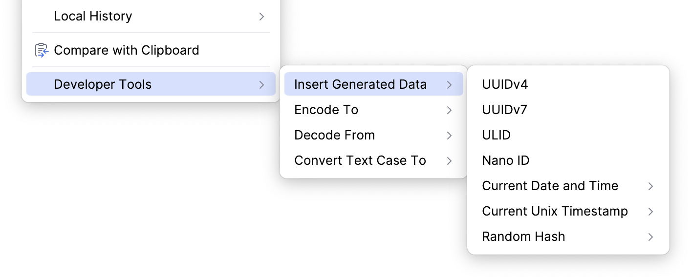

# IntelliJ Developer Tools Plugin

Developer Tools brings a practical toolbox of everyday development utilities directly into IntelliJ-based IDEs. It keeps common tasks such as encoding data, transforming text, validating JSON, generating identifiers, inspecting archives, formatting code and SQL, and checking certificates inside the IDE, so you do not need to switch to separate web tools or command-line snippets.

Main toolbar window:

Editor menu:

Plugin icon by [Gabriele Malaspina](https://www.svgrepo.com/svg/489187/toolbox).

## Key Features

- JWT Encoder/Decoder
- Base32, Base64, URL Base64, MIME Base64, URL, and ASCII Encoder/Decoder
- Text escaping and unescaping for HTML entities, Java strings, JSON, CSV, XML, and escape sequences
- Regular Expression Matcher
- UUID, ULID, Nano ID, password, QR code/barcode, Lorem Ipsum, and ASCII art generators
- Text Sorting
- Text Case Transformation
- Text Diff Viewer
- Text Format Conversion
- Text Statistic
- Text Filter
- JSON Path Parser
- JSON Schema Validator
- Hashing and HMAC
- HTTP Server (WireMock)
- Archive viewer and extractor for ZIP, TAR, JAR, 7z, and other formats
- Date and time tools for Unix timestamps, formatting, and parsing
- Unit converters for time, data size, and transfer rate
- Code Style Formatting
- SQL Formatting
- CLI Command Conversion
- Color Picker
- Fetching, analyzing, and exporting server certificates
- Notes

## Integration

The full toolbox is available in both a persistent tool window and a standalone dialog. Tools can have multiple named workbenches, so you can keep separate inputs and configurations for different tasks. Frequently used text operations are also available from the editor popup menu and as intentions; depending on the action, they work on selected text or on the Java/Kotlin string or identifier at the caret.

Plugin settings are available in IntelliJ IDEA's settings/preferences under **Tools | Developer Tools**.

### Tool Window

The tool window is available through **View | Tool Windows | Developer Tools**. Inputs, selected tools, expanded menu groups, and tool configuration are stored per project.

### Dialog

The dialog is available from IntelliJ IDEA's main menu under **Tools | Developer Tools**.

To add the "Open Dialog" action to the main toolbar, enable it in IntelliJ IDEA's settings/preferences under **Tools | Developer Tools**, or add it manually via **Customize Toolbar... | Add Actions... | Developer Tools**.

Dialog inputs, selected tools, expanded menu groups, and tool configuration are stored at the application level.

## Development

This plugin is not treated as a library, so code changes do not necessarily follow semantic versioning rules.

If you want to contribute, please follow the code style defined in `.editorconfig` and sign your commits.
